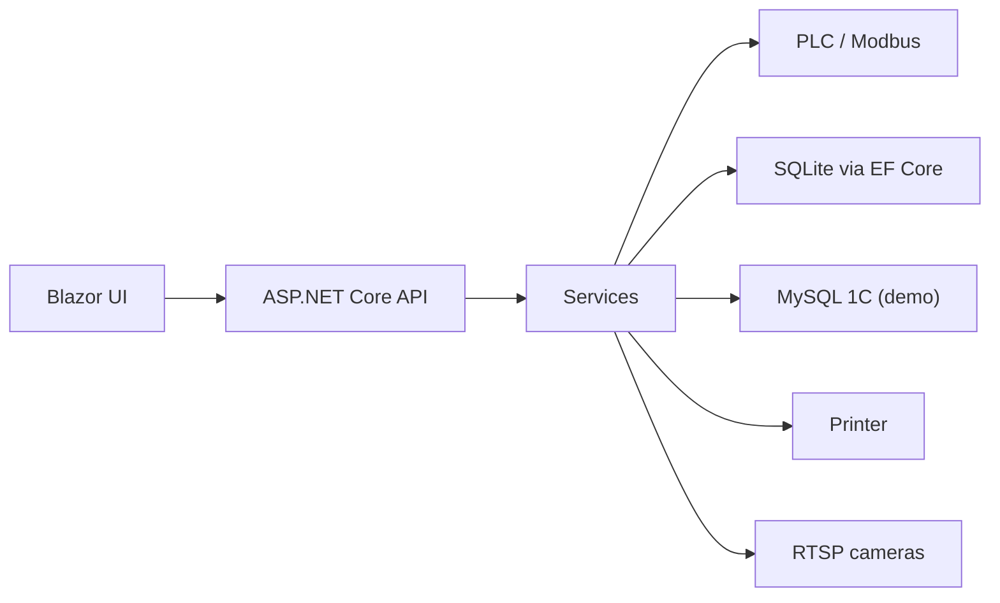
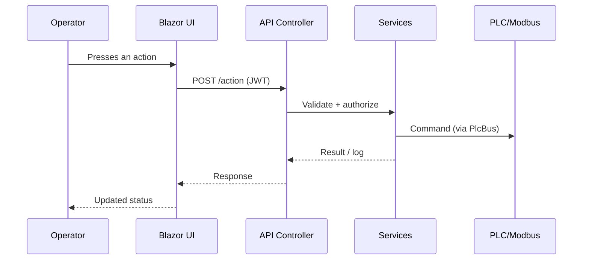
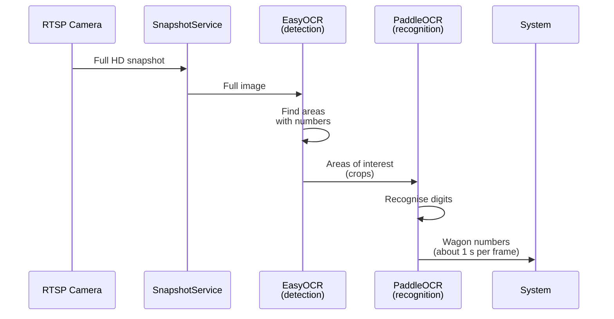

# Diagrams (Mermaid)

## Components

```mermaid
flowchart LR
  UI[Blazor UI] --> API[ASP.NET Core API]
  API --> Services[Services]
  Services --> PLC[PLC / Modbus]
  Services --> DB[SQLite via EF Core]
  Services --> OneC["MySQL 1C (demo)"]
  Services --> Print[Printer]
  Services --> Camera[RTSP cameras]
```

## Event flow (sequence)

```mermaid
sequenceDiagram
  participant Operator
  participant UI as Blazor UI
  participant API as API Controller
  participant S as Services
  participant PLC as PLC/Modbus
  Operator->>UI: Presses an action
  UI->>API: POST /action (JWT)
  API->>S: Validate + authorize
  S->>PLC: Command (via PlcBus)
  S-->>API: Result / log
  API-->>UI: Response
  UI-->>Operator: Updated status
```

## OCR pipeline (EasyOCR + PaddleOCR)

```mermaid
sequenceDiagram
  participant Camera as RTSP Camera
  participant Snapshot as SnapshotService
  participant EasyOCR as EasyOCR<br/>(detection)
  participant PaddleOCR as PaddleOCR<br/>(recognition)
  participant System as System

  Camera->>Snapshot: Full HD snapshot
  Snapshot->>EasyOCR: Full image
  EasyOCR->>EasyOCR: Find areas<br/>with numbers
  EasyOCR->>PaddleOCR: Areas of interest<br/>(crops)
  PaddleOCR->>PaddleOCR: Recognise digits
  PaddleOCR->>System: Wagon numbers<br/>(about 1 s per frame)
```
